# ⚡ Catalyst — AI Commerce Revenue Agent

<div align="center">

[](https://fastapi.tiangolo.com)
[](https://react.dev)
[](https://tailwindcss.com)
[](https://ai.google.dev)
[](https://razorpay.com)
[](https://docs.pytest.org)
[](https://frontend-two-zeta-16.vercel.app)
[](https://catalyst-880d.onrender.com/docs)
[](LICENSE)

**Turn AI discovery into measurable, verified revenue.**  
*Closed-Loop AI Commerce Employee for the Agentic Economy.*

[🌐 Live Platform Dashboard](https://frontend-two-zeta-16.vercel.app) • [🛒 Live Demo Storefront](https://apex-outdoor.vercel.app) • [⚡ FastAPI Docs](https://catalyst-880d.onrender.com/docs) • [🎬 Full Pitch Video](file:///Users/sanidhyakumar/Documents/razorpay/media/catalyst_full_site_demo.mp4)

</div>

---

## 📌 Table of Contents

- [The Silent Crisis in AI Commerce](#-the-silent-crisis-in-ai-commerce)
- [What is Catalyst?](#-what-is-catalyst)
- [Live Deployments](#-live-deployments)
- [Closed-Loop Agent Architecture](#-closed-loop-agent-architecture)
- [Deterministic Engineering Boundaries](#-deterministic-engineering-boundaries)
- [The 5-Signal Anti-Spoof Attribution Engine](#-the-5-signal-anti-spoof-attribution-engine)
- [Razorpay Rails & Payment Synergy](#-razorpay-rails--payment-synergy)
- [The 5-Beat Demo Narrative](#-the-5-beat-demo-narrative)
- [API Reference](#-api-reference)
- [Project Directory Structure](#-project-directory-structure)
- [Local Development & Quick Start](#-local-development--quick-start)
- [Testing & Quality Verification](#-testing--quality-verification)
- [Razorpay Buildathon 2026 Submission](#-razorpay-buildathon-2026-submission)

---

## 🚨 The Silent Crisis in AI Commerce

Every single day, millions of high-intent buyers stop typing queries into Google and start asking autonomous AI shopping agents (**ChatGPT**, **Claude**, **Perplexity**, **Apple Intelligence**) what to purchase.

```
      Traditional Shopper                           Agentic AI Shopper
  ┌─────────────────────────┐                   ┌─────────────────────────┐
  │ Reads pretty banners    │                   │ Parses structured JSON  │
  │ Swayed by ad copy       │        VS         │ Demands technical specs │
  │ Browses visual carousels│                   │ Verifies schema facts   │
  └─────────────────────────┘                   └─────────────────────────┘
```

### The Problem:
* Online stores sell superior physical products, but their catalogs are trapped in **unstructured plain-text HTML**.
* When an AI crawler inspects the store, it cannot verify specifications like waterproof hydrostatic head ratings, outsole compound, lug depth, or weight.
* **The Result:** The AI agent awards the recommendation to competitor brands that expose machine-readable **Schema.org JSON-LD microdata**.
* In our benchmark with **Apex Ridge Outdoors**, Apex suffered a **15% AI win rate vs 55% for competitor Monsoon Trekker** — losing high-margin revenue on every search.

---

## ⚡ What is Catalyst?

**Catalyst is not a chatbot or a passive analytics dashboard.** It is an **autonomous closed-loop AI employee** that:
1. **Finds Demand Loss**: Audits 40 high-intent AI shopping queries across your store and competitors.
2. **Diagnoses Evidence Deficits**: Identifies exact missing machine-readable attributes (IPX ratings, lug depths, fabric ratings).
3. **Generates Grounded Fixes**: Synthesizes verified Schema.org JSON-LD and microdata patches strictly bounded by warehouse supplier specs (0 hallucinations).
4. **Enforces Human Sign-Off**: Halts at a deterministic **Human Approval Gate** (`WAIT_FOR_APPROVAL`) before any changes touch production.
5. **Injects Live Microdata**: Updates storefronts with machine-indexable attributes and NPCI ACP protocol compliance.
6. **Proves Incremental GMV**: Measures causal revenue lift via a 3,000-session synthetic A/B experiment and defends against scrapers with a **5-Signal Anti-Spoof Shield**.

---

## 🌐 Live Deployments

| Component | Production URL | Description |
|---|---|---|
| **Catalyst Dashboard** | [frontend-two-zeta-16.vercel.app](https://frontend-two-zeta-16.vercel.app) | Real-time merchant command center, Opportunity Cards, AI Shopper Sandbox, and Deterministic Proof Hub |
| **Demo Storefront** | [apex-outdoor.vercel.app](https://apex-outdoor.vercel.app) | Live merchant e-commerce storefront (Unpatched Baseline vs Catalyst Enhanced) |
| **Enhanced Storefront** | [apex-outdoor.vercel.app/?enhanced=true](https://apex-outdoor.vercel.app/?enhanced=true) | Live store with injected 11 technical specs, green badge, and Schema.org JSON-LD |
| **FastAPI Backend** | [catalyst-880d.onrender.com/docs](https://catalyst-880d.onrender.com/docs) | Interactive OpenAPI / Swagger API documentation and endpoints |

---

## 🏗️ Closed-Loop Agent Architecture

```mermaid
flowchart TD
    subgraph Discovery ["1. Discover Demand Loss"]
        A[Merchant Storefront] -->|Scan Catalog| B[40 AI Shopping Query Vectors]
        B -->|Gemini 3.5 Flash Reasoning| C[Spot 15% vs 55% Win Rate Gap]
    end

    subgraph Diagnosis ["2. Diagnose Deficit"]
        C --> D[Identify Missing Machine Specs]
        D --> E[Competitor: 11 Specs JSON-LD vs Merchant: 5 Plain Text]
    end

    subgraph GroundedFix ["3. Grounded Fix Formulation"]
        E --> F[Extract Verified Warehouse Facts]
        F --> G[Synthesize FixDiff apex-01]
        G --> H{Human Approval Gate<br/>WAIT_FOR_APPROVAL}
    end

    subgraph Deployment ["4. Live Store Injection"]
        H -->|Merchant Clicks Approve| I[Inject Schema.org JSON-LD]
        I --> J[Live Store: 15,000mm IPX7 + Vibram 5mm Specs]
    end

    subgraph Attribution ["5. Deterministic Proof Hub"]
        J --> K[Autonomous AI Shopper Sandbox]
        K --> L[3,000-Session A/B Experiment]
        L --> M[5-Signal Anti-Spoof Classifier]
        M --> N[+₹1.50L Verified Incremental AI GMV]
        N --> O[Razorpay Checkout Rails & Webhook Verification]
    end

    style Discovery fill:#1e293b,stroke:#3b82f6,stroke-width:2px,color:#fff
    style Diagnosis fill:#1e293b,stroke:#f59e0b,stroke-width:2px,color:#fff
    style GroundedFix fill:#1e293b,stroke:#8b5cf6,stroke-width:2px,color:#fff
    style Deployment fill:#1e293b,stroke:#10b981,stroke-width:2px,color:#fff
    style Attribution fill:#1e293b,stroke:#06b6d4,stroke-width:2px,color:#fff
    style H fill:#312e81,stroke:#a855f7,stroke-width:2px,color:#fff
```



---

## 🛡️ Deterministic Engineering Boundaries

Catalyst enforces strict engineering separation between **LLM Reasoning** and **Deterministic Execution**:

```text
               ┌─────────────────────────────────────────┐
               │         Gemini 3.5 Flash Model          │
               │   (Semantic Reasoning & Gap Analysis)   │
               └────────────────────┬────────────────────┘
                                    │ Bounded Tool Calls Only
     ┌──────────────────────────────┼──────────────────────────────┐
     ▼                              ▼                              ▼
inspect_catalog()            diagnose_gap()               generate_fix_diff()
     │                              │                              │
     └──────────────────────────────┼──────────────────────────────┘
                                    ▼
               ┌─────────────────────────────────────────┐
               │             FastAPI Backend             │
               │       (Deterministic Source of Truth)    │
               └────────────────────┬────────────────────┘
                                    │
     ┌──────────────────────────────┼──────────────────────────────┐
     ▼                              ▼                              ▼
Diagnosis Engine           5-Signal Classifier            Experiment Engine
(Fact Verification)      (Deterministic Rules Math)      (Causal A/B GMV Lift)
```

### Critical Rules:
1. **Zero Hallucination in Catalog Fixes**: Fixes are strictly compiled from verified warehouse and supplier technical datasheets.
2. **No LLM in the Revenue Scoring Loop**: All GMV summation, treatment/control splitting, confidence intervals, and spoof penalization are calculated via deterministic Python arithmetic.
3. **Mandatory Merchant Gate**: No AI agent can write directly to merchant production databases without explicit human cryptographic approval (`proposed` → `approved` → `applied`).
4. **Leakage-Free Holdout Evaluation**: Classifier accuracy and spoof rejection metrics are evaluated strictly on segregated holdout datasets.

---

## 🔍 The 5-Signal Anti-Spoof Attribution Engine

To prevent scrapers, bots, and dishonest analytics from claiming fake AI revenue, Catalyst uses a **5-signal deterministic classifier**:

$$\text{Score} = S_1 + S_2 + S_3 + S_4 + S_5 - 2 \times \mathbb{I}(\text{Forged Signature})$$

| Signal | Evaluation Rule | Weight | Purpose |
|---|---|---|---|
| **$S_1$: Referrer Header** | Recognized AI crawler signature (`chatgpt.com`, `perplexity.ai`, `claude.ai`) | `+1` | Validates entry origin |
| **$S_2$: Query Intent Match** | High-intent commercial keyword alignment | `+1` | Verifies buyer purchase intent |
| **$S_3$: Dwell & Token Velocity** | Natural human/agent token reading velocity vs instant bounce | `+1` | Distinguishes crawlers from click fraud |
| **$S_4$: ASN & IP Range** | Origin IP matches verified cloud ASNs (OpenAI, Anthropic, Perplexity) | `+1` | Hardware-level identity check |
| **$S_5$: Response Entropy** | Payload complexity consistent with LLM agent tool-call execution | `+1` | Validates agent protocol handshake |
| **Spoof Penalty** | Header mismatch, impossible velocity, or forged ASN signature | `-2` | Immediate exclusion from verified GMV |

```
Classification Thresholds:
├── Score >= 4  → VERIFIED AI REVENUE (Attributed to Catalyst Lift)
├── Score 2 - 3 → AMBIGUOUS TRAFFIC   (Excluded from claimed GMV)
└── Score <= 1  → REJECTED / SPOOFED  (Logged to Security Audit Trail)
```

> **Core Philosophy**: *"Catalyst would rather undercount than falsely claim unearned revenue."*

---

## 💳 Razorpay Rails & Payment Synergy

Catalyst bridges the gap between **AI Discovery** and **Real Digital Payments**:

1. **Simulated Agent Checkout Sessions**: The Autonomous AI Shopper triggers standard Razorpay checkout payload protocols (`order_sim_880d7a`).
2. **Webhook Verification**: Catalyst validates signed Razorpay payment events (`pay_sim_99ac`) before registering attributed GMV.
3. **NPCI ACP & Schema.org Offers Compliance**: Structured pricing, INR currency codes, and stock status are formatted for immediate NPCI agentic commerce protocol parsing.

---

## 🎙️ The 5-Beat Demo Narrative

| Beat | Stage | Visual & Functional Experience |
|---|---|---|
| **01** | **Discover** | Merchant is recommended in only 3/20 trials vs Competitor Monsoon Trekker's 11/20 trials on high-intent boot queries. |
| **02** | **Diagnose** | Gemini 3.5 Flash reveals the deficit: 5 plain text attributes vs competitor's 11 machine-readable JSON-LD specs. |
| **03** | **Fix & Approve** | Agent drafts `FixDiff apex-01`. Backend validates facts. Merchant reviews diff and clicks **Approve & Deploy**. |
| **04** | **Prove Lift** | 3,000-session randomized synthetic trial records **+₹1.50L Net Incremental AI GMV** (+125% lift, 97% confidence). |
| **05** | **Anti-Spoof Defense** | A forged referrer bot attempt is inspected and **REJECTED** (-2 penalty), excluding ₹2,500 from verified GMV. |

---

## 📡 API Reference

The FastAPI backend exposes fully documented REST endpoints at `/api`:

### Catalog & Diagnosis
- `GET /api/catalog` — Retrieve merchant and competitor catalog items.
- `GET /api/opportunities` — Ranked list of high-impact AI revenue opportunities.
- `POST /api/diagnose` — Run 40-query live diagnostic benchmark on a store URL.

### Grounded Fixes & Approval Gate
- `GET /api/fixes/{fix_id}` — Inspect FixDiff JSON payload and warehouse grounding source.
- `POST /api/fixes/{fix_id}/approve` — Merchant approval action; applies patch to live store.
- `POST /api/fixes/{fix_id}/reject` — Rejects proposed patch with merchant feedback.

### Experiments & Attribution
- `GET /api/experiments/latest` — Fetch latest 3,000-session causal A/B lift results.
- `POST /api/experiments/run` — Trigger re-seeded randomized synthetic A/B trial.
- `GET /api/attribution/evaluation` — Precision, recall, and spoof rejection on holdout dataset.
- `GET /api/sessions` — Real-time stream of evaluated shopper sessions.

### Demo Lifecycle
- `POST /api/demo/reset` — Atomically wipe database state and reset demo to clean initial state.
- `GET /api/agent/state` — Current lifecycle state (`OBSERVE`, `DIAGNOSE`, `PROPOSE`, `APPLY`, `MEASURE`).

---

## 📂 Project Directory Structure

```text
razorpay/
├── backend/
│   ├── agent/             # Gemini 3.5 Flash reasoning agent & tool declarations
│   ├── api/               # FastAPI route controllers (diagnostics, fixes, experiments)
│   ├── db/                # SQLite database models and migration handlers
│   ├── engines/           # 5-Signal Classifier, Experiment Engine, Diagnosis Engine
│   ├── evaluation/        # Holdout dataset evaluation and leakage verification
│   ├── generators/        # Synthetic shopping session & catalog generators
│   ├── models/            # Pydantic schemas and domain dataclasses
│   ├── tests/             # Pytest automated test suite (12 passed)
│   ├── config.py          # Environment settings & API keys
│   └── main.py            # FastAPI application entrypoint
│
├── frontend/
│   ├── src/
│   │   ├── api/           # Axios API client connecting to backend
│   │   ├── components/    # UI Components (Navbar, ProofHub, DiffModal, Walkthrough)
│   │   ├── App.jsx        # Main application router and state manager
│   │   ├── main.jsx       # React DOM root mounting
│   │   └── index.css      # Custom design tokens, dark mode glassmorphism
│   ├── package.json       # Frontend dependencies (React 18, Lucide, Tailwind)
│   └── vite.config.js     # Vite bundler configuration
│
├── stores/
│   └── apex-outdoor/      # Standalone static storefront for live demo testing
│
├── scripts/
│   ├── setup.sh                   # One-click environment bootstrap script
│   ├── run_demo.sh                # Local dev server launcher (Vite + FastAPI)
│   ├── run_full_pipeline.sh       # Synthetic data generation pipeline
│   ├── automate_full_site_video.py# Playwright 4K recording & FFmpeg sync engine
│   └── generate_voiceover_fast.py # Edge-TTS multi-segment voiceover generator
│
├── media/                 # High-resolution demo videos and verification frames
├── requirements.txt       # Python backend dependencies
└── README.md              # Project documentation
```

---

## 💻 Local Development & Quick Start

### 1. Prerequisites
- Python 3.10+
- Node.js 18+ & npm
- FFmpeg (for video rendering)

### 2. Clone Repository & Setup Virtualenv
```bash
git clone https://github.com/SpaceCypher/catalyst.git
cd catalyst

# Setup Python virtual environment
python3 -m venv .venv
source .venv/bin/activate
pip install -r requirements.txt
```

### 3. Setup Frontend
```bash
cd frontend
npm install
cd ..
```

### 4. Configure Environment Variables
Create a `.env` file in the root directory:
```env
GEMINI_API_KEY=your_gemini_api_key_here
FASTAPI_PORT=8000
DATABASE_URL=sqlite:///./data/catalyst.db
ENVIRONMENT=development
```

### 5. Run Local Development Servers
```bash
# Terminal 1: Start FastAPI Backend
source .venv/bin/activate
uvicorn backend.main:app --host 0.0.0.0 --port 8000 --reload

# Terminal 2: Start Vite Frontend
cd frontend
npm run dev
```

Visit:
- **Dashboard**: [http://localhost:5173](http://localhost:5173)
- **API Docs**: [http://localhost:8000/docs](http://localhost:8000/docs)

---

## 🧪 Testing & Quality Verification

Run the comprehensive automated pytest suite:

```bash
source .venv/bin/activate
pytest -v
```

### Test Coverage Highlights:
- ✅ `test_api_endpoints.py`: Verifies diagnosis, fix generation, merchant approval gate, and autonomous cycle.
- ✅ `test_attribution_classifier.py`: Evaluates deterministic 5-signal combinations and spoof penalty assertions.
- ✅ `test_catalog_generator.py`: Verifies catalog schema conformity and fact integrity.
- ✅ `test_evaluate_classifier.py`: Enforces zero data leakage on held-out test splits.
- ✅ `test_experiment_engine.py`: Verifies mathematical consistency of causal treatment/control GMV calculations.

---

## 🏆 Razorpay Buildathon 2026 Submission

- **Track**: AI Commerce, Agentic Workflows & Digital Payment Rails
- **Team / Author**: [SpaceCypher](https://github.com/SpaceCypher) / Sanidhya Kumar
- **Core Value Proposition**: Giving Indian enterprise merchants the power to be discovered, trusted, and paid in the autonomous AI agent economy.

<div align="center">
  <sub>Built with ⚡ for the Razorpay Buildathon 2026.</sub>
</div>
